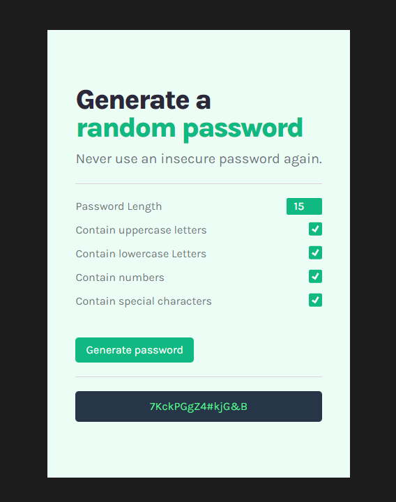
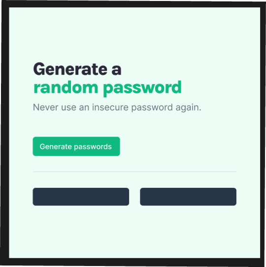

# Random Password Generator App

## Welcome! 👋

Thanks for checking out this small project. I created this App as a part of my challenge 100 days of coding. 

The design of the app was created by [Scrimba](https://www.scrimba.com).

I've added all password customization options (password length, charachters type selection) and copy to clipboard funcionality.

I've also added custom styles to all inputs.

- Live Site URL: (https://coruscating-speculoos-1c3e7d.netlify.app/)

## Built with

- SCSS
   - Flexbox
   - Grid
- Vanilla JS